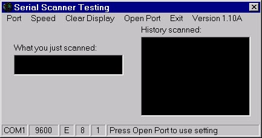



## ComScanner

### Description

Program to use a serial scanner (program with type 39 bar code) to view what was scanned into a com port. Program will let you change baud, bit, com port, etc....
 
### More Info
 

             |
---                |---
**Submitted On**   |2000-09-28 09:21:58
**By**             |[Mike Reed](https://github.com/Planet-Source-Code/PSCIndex/blob/master/ByAuthor/mike-reed.md)
**Level**          |Beginner
**User Rating**    |4.0 (12 globes from 3 users)
**Compatibility**  |VB 5\.0, VB 6\.0
**Category**       |[Miscellaneous](https://github.com/Planet-Source-Code/PSCIndex/blob/master/ByCategory/miscellaneous__1-1.md)
**World**          |[Visual Basic](https://github.com/Planet-Source-Code/PSCIndex/blob/master/ByWorld/visual-basic.md)
**Archive File**   |[CODE\_UPLOAD1262112122000\.zip](https://github.com/Planet-Source-Code/mike-reed-comscanner__1-13543/archive/master.zip)

